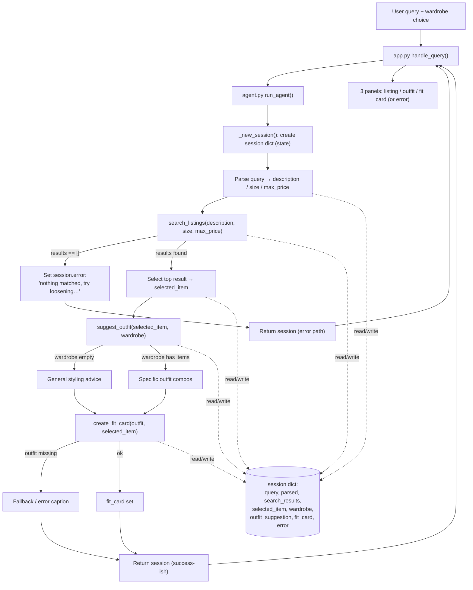

# FitFindr — planning.md

> Complete this document before writing any implementation code.
> Your spec and agent diagram are what you'll use to direct AI tools (Claude, Copilot, etc.) to generate your implementation — the more specific they are, the more useful the generated code will be.
> Your planning.md will be reviewed as part of your submission.
> Update it before starting any stretch features.

---

## Tools

List every tool your agent will use. For each tool, fill in all four fields.
You must have at least 3 tools. The three required tools are listed — add any additional tools below them.

### Tool 1: search_listings

**What it does:**
Searches the 40-item mock listings dataset for pieces that match the user's
keywords, optional size, and optional price ceiling, and returns them ranked by
how well they match. This is the agent's entry point — it turns a vague request
into concrete candidate items.

**Input parameters:**
- `description` (str): keywords describing the desired item, e.g. `"vintage graphic tee"`. Scored against each listing's `title`, `description`, `style_tags`, and `category`.
- `size` (str | None): size to filter by; matched case-insensitively as a substring so `"M"` matches `"S/M"`. `None` skips size filtering.
- `max_price` (float | None): inclusive price ceiling. `None` skips price filtering.

**What it returns:**
A `list[dict]` of matching listings, sorted by relevance score (best first).
Each dict carries the full listing record: `id`, `title`, `description`,
`category`, `style_tags`, `size`, `condition`, `price`, `colors`, `brand`,
`platform`. Returns an empty list `[]` when nothing matches — it never raises.

**What happens if it fails or returns nothing:**
Returns `[]` rather than throwing. The planning loop detects the empty list,
sets `session["error"]` to a message telling the user what to loosen (raise the
price, drop the size filter, or broaden the keywords), and stops before
`suggest_outfit` is ever called. (Stretch: auto-retry with the size filter
removed before giving up.)

---

### Tool 2: suggest_outfit

**What it does:**
Takes the item the user is considering and their existing wardrobe and asks the
LLM to propose 1–2 complete, specific outfits that combine the new piece with
named items they already own.

**Input parameters:**
- `new_item` (dict): a listing dict (the top result from `search_listings`) — the piece being styled.
- `wardrobe` (dict): a wardrobe dict with an `"items"` key holding a list of wardrobe-item dicts (`id`, `name`, `category`, `colors`, `style_tags`, `notes`). May be empty.

**What it returns:**
A non-empty `str` describing one or two outfit combinations in natural language,
referencing the new item plus specific wardrobe pieces by name (e.g. "pair it
with your baggy straight-leg jeans and chunky white sneakers").

**What happens if it fails or returns nothing:**
If `wardrobe["items"]` is empty, it doesn't fail — it switches to a general
styling prompt (what kinds of pieces pair well, what vibe the item suits) so a
new user with no wardrobe still gets useful advice. It always returns a
non-empty string; if the LLM call errors, it returns a short fallback styling
note rather than raising.

---

### Tool 3: create_fit_card

**What it does:**
Generates a short, casual, shareable caption for the find — the kind of thing
you'd actually post on Instagram/TikTok — built from the item details and the
outfit suggestion.

**Input parameters:**
- `outfit` (str): the outfit suggestion string returned by `suggest_outfit`.
- `new_item` (dict): the listing dict for the thrifted item (for name, price, platform).

**What it returns:**
A 2–4 sentence `str` caption that names the item, price, and platform naturally
(once each), captures the outfit vibe in specific terms, and reads like a real
OOTD post rather than a product description. It uses a higher LLM temperature so
the output differs for different inputs (and run to run).

**What happens if it fails or returns nothing:**
If `outfit` is empty or whitespace-only, it does NOT call the LLM — it returns a
descriptive error string (e.g. "Can't build a fit card without an outfit
suggestion."). If the LLM call errors, it returns a minimal fallback caption
built from the item's title and price so the user still gets something usable.

---

### Additional Tools (stretch — implemented)

**Tool 4: `estimate_price_fairness(new_item, listings=None) -> dict`**
Compares a listing's price against same-category listings in the dataset and
returns a fairness verdict with reasoning.
- `new_item` (dict): the listing being evaluated.
- `listings` (list[dict] | None): comparison pool; defaults to `load_listings()`.
- Returns a dict: `verdict` ("good deal" / "fair" / "overpriced" / "unknown"),
  `reasoning` (str), `avg_price` (float | None), `comparables` (int).
- **Failure mode:** if fewer than 3 same-category comparables exist, returns
  `verdict="unknown"` with an explanation instead of a misleading number.

**Tool 5: `get_trending_styles(size=None, trends=None) -> dict`**
Reads a snapshot of trending style tags (mock fashion-platform feed) and returns
what's popular, optionally narrowed to the user's size range.
- `size` (str | None): size to narrow trends to; `None` returns overall trends.
- `trends` (dict | None): trend data; defaults to loading `data/trends.json`.
- Returns a dict: `trending_tags` (list[str]), `source` (str), `note` (str).
- **Failure mode:** if the trends file is missing/empty, returns an empty
  `trending_tags` list and a note saying trends are unavailable — the agent then
  styles the item normally without trend influence.

---

## Planning Loop

**How does your agent decide which tool to call next?**

The loop is a guarded, state-driven sequence — not a fixed pipeline. After each
step the agent inspects the session and decides whether to continue, branch to an
error response, or finish. The decision at each stage is based on what the
previous tool actually returned:

1. **Parse** the query into `description` / `size` / `max_price` → store in `session["parsed"]`.
2. **Search.** Call `search_listings(**parsed)`.
   - *Branch:* if `search_results` is empty → set `session["error"]` and **stop**. Do not advance.
3. **Select** the top-ranked result → `session["selected_item"]`.
4. **Suggest outfit.** Call `suggest_outfit(selected_item, wardrobe)`.
   - The tool itself branches internally on whether the wardrobe is empty (specific combos vs. general styling), so the loop always gets a usable string back.
5. **Fit card.** Call `create_fit_card(outfit_suggestion, selected_item)`.
   - *Branch:* if there is no usable outfit string, the card tool returns an error/fallback string rather than the loop crashing.
6. **Done** when `fit_card` is set (success) or `error` is set (early exit).

What makes it a real planning loop rather than a hardcoded chain: the agent
checks the **output** of each tool before choosing the next action, and the path
changes (full flow vs. early stop vs. general-advice fallback) depending on those
outputs. The agent never calls a downstream tool with empty/invalid input.

---

## State Management

**How does information from one tool get passed to the next?**

A single **session dict** (created by `_new_session()` in `agent.py`) is the one
source of truth for the whole interaction. Each tool reads from it and writes its
result back into it, so later tools never re-derive or re-request earlier data.

Tracked fields:

| Field | Written by | Read by |
|-------|-----------|---------|
| `query` | entry point | parse step |
| `parsed` (`description`, `size`, `max_price`) | parse step | `search_listings` |
| `search_results` | `search_listings` | selection step |
| `selected_item` | selection step | `suggest_outfit`, `create_fit_card` |
| `wardrobe` | entry point | `suggest_outfit` |
| `outfit_suggestion` | `suggest_outfit` | `create_fit_card` |
| `fit_card` | `create_fit_card` | final output |
| `error` | any step on failure | final output / UI |

Concretely, the item found by `search_listings` lands in `selected_item` and
flows straight into both `suggest_outfit` and `create_fit_card` — the user never
re-enters it. `run_agent` returns the completed session dict; callers check
`session["error"]` first, then read the output fields.

---

## Error Handling

For each tool, describe the specific failure mode you're handling and what the agent does in response.

| Tool | Failure mode | Agent response |
|------|-------------|----------------|
| search_listings | No results match the query (returns `[]`) | Loop sets `session["error"]` with a message telling the user what to loosen (raise price / drop size / broaden keywords) and stops before any downstream tool. Stretch: auto-retry without the size filter and report the adjustment. |
| suggest_outfit | Wardrobe is empty (`items == []`) | Switches to a general-styling prompt instead of failing, so a new user still gets advice; always returns a non-empty string. On LLM error, returns a short fallback styling note. |
| create_fit_card | Outfit input is missing or incomplete (empty/whitespace) | Skips the LLM call and returns a descriptive error string; on LLM error, returns a minimal caption built from the item title and price. Never raises. |

---

## Architecture

**Reading the diagram:** every tool reads from and writes to the shared `session`
dict (dotted lines). Solid lines are the control flow. The two error branches off
`search_listings` (no results → stop) and `create_fit_card` (no outfit →
fallback), plus the internal branch inside `suggest_outfit` (empty vs. populated
wardrobe), are where behavior changes based on tool output.

---

## AI Tool Plan

<!-- For each part of the implementation below, describe:
     - Which AI tool you plan to use (Claude, Copilot, ChatGPT, etc.)
     - What you'll give it as input (which sections of this planning.md, your agent diagram)
     - What you expect it to produce
     - How you'll verify the output matches your spec before moving on

     "I'll use AI to help me code" is not a plan.
     "I'll give Claude my Tool 1 spec (inputs, return value, failure mode) and ask it to implement
     search_listings() using load_listings() from the data loader — then test it against 3 queries
     before trusting it" is a plan. -->

**Milestone 3 — Individual tool implementations:**
- **Tool:** Claude (in Claude Code), working directly in `tools.py`.
- **Input I'll give it:** the Tool 1/2/3 sections above (inputs, return type, failure mode) plus the existing docstrings/TODOs in `tools.py` and the `load_listings()` / `get_example_wardrobe()` helpers.
- **What I expect it to produce:** `search_listings` as pure Python (keyword scoring over title/description/style_tags/category, size substring match, price filter, drop score-0, sort desc); `suggest_outfit` and `create_fit_card` as Groq LLM calls with the branch logic and temperature noted above.
- **How I'll verify:** test each tool in isolation before wiring the loop —
  `search_listings` against ~3 queries incl. a no-match (expect `[]`);
  `suggest_outfit` with `get_example_wardrobe()` AND `get_empty_wardrobe()`;
  `create_fit_card` with a real outfit, an empty string (expect error msg), and twice with the same input to confirm it varies.

**Milestone 4 — Planning loop and state management:**
- **Tool:** Claude (in Claude Code), working in `agent.py` then `app.py`.
- **Input I'll give it:** the Planning Loop, State Management, and Architecture sections above, plus the `_new_session()` scaffold and the step-by-step TODO already in `run_agent()`.
- **What I expect it to produce:** `run_agent` implementing the guarded sequence — parse → search → (empty? set error + return) → select → suggest → card → return session — reading/writing only the session dict; then `handle_query` in `app.py` mapping the session to the 3 panels (error in panel 1 when set).
- **How I'll verify:** run `python agent.py` (happy path + the deliberate no-results query) and confirm the error path stops before `suggest_outfit`; then `python app.py` and exercise the example queries incl. the no-results one and the empty-wardrobe toggle.

---

## A Complete Interaction (Step by Step)

Write out what a full user interaction looks like from start to finish — tool call by tool call. Use a specific example query.

**What FitFindr needs to do (in my own words):**
FitFindr is a multi-tool agent that takes a natural-language thrifting request and turns it into a styled, shareable recommendation. It parses the request into search constraints and calls `search_listings` to find a matching secondhand piece; that found item then flows into `suggest_outfit`, which pairs it against the user's wardrobe, and finally into `create_fit_card`, which writes a caption-style blurb. A planning loop decides which tool runs next based on what the previous tool returned — and if any tool comes back empty (e.g. no listings match, or the wardrobe is empty), the agent stops or adapts and tells the user what to change instead of passing empty data downstream or crashing.

**Example user query:** "I'm looking for a vintage graphic tee under $30. I mostly wear baggy jeans and chunky sneakers. What's out there and how would I style it?"

**Step 1 — Search:**
The agent parses the query into search constraints and calls
`search_listings(description="vintage graphic tee", size="M", max_price=30.0)`.
This filters the 40-item listings dataset (matching against `title`, `description`, `style_tags`, `category`, `size`, and `price`) and returns the matching listings ranked by relevance. The agent picks the top result, e.g. lst_002 *"Y2K Baby Tee — Butterfly Print" — $18, Depop, excellent condition*.
→ **Error branch:** if the result list is empty, the agent does NOT call `suggest_outfit`. It reports that nothing matched and suggests loosening a constraint (raise `max_price`, drop the size filter, broaden the description).

**Step 2 — Suggest outfit:**
Using state from Step 1, the agent calls
`suggest_outfit(new_item=<top listing from Step 1>, wardrobe=get_example_wardrobe())`.
It returns one or more outfit combinations drawn from the wardrobe items, e.g. *"Pair it with your baggy straight-leg jeans and chunky white sneakers; layer the vintage black denim jacket on top for a 90s streetwear feel."*
→ **Error branch:** if `wardrobe["items"]` is empty (`get_empty_wardrobe()`), the tool can't build a combo, so the agent asks the user to describe a few pieces they own, or suggests a generic styling for the item on its own.

**Step 3 — Fit card:**
Using state from Steps 1 and 2, the agent calls
`create_fit_card(outfit=<suggestion from Step 2>, new_item=<item from Step 1>)`.
It returns a short, shareable caption that varies per input, e.g. *"found this y2k butterfly baby tee on depop for $18 ✨ styling it with my baggy jeans + chunky sneakers — 2003 was right about everything 🦋"*.
→ **Error branch:** if the outfit or item data is missing/incomplete, the agent falls back to a simpler caption built from whatever fields are present (at minimum the item title and price) rather than failing.

**Final output to user:**
The user sees the chosen listing (title, price, platform, condition), the styling suggestion that pairs it with their existing wardrobe, and the ready-to-post fit card caption — the full search → style → share flow from a single natural-language request.

---

## Stretch Features (planned before implementation)

All four stretch features were specced here before coding, per the assignment rule.

### Stretch A — Retry logic with fallback
**Goal:** when `search_listings` returns zero results, don't immediately fail —
automatically retry with loosened constraints and tell the user what changed.
**Logic (in `run_agent`):**
1. Search with full constraints (description + size + max_price).
2. If empty **and** a size filter was set → retry without size; record adjustment "removed the size *X* filter".
3. If still empty **and** a price ceiling was set → retry without price; record adjustment "ignored the $*Y* budget".
4. If still empty → set `session["error"]` with concrete suggestions and stop.
On a successful retry, `session["adjustments"]` lists what was loosened and the
agent surfaces a "Heads up — I had to … to find this" note to the user.

### Stretch B — Price comparison tool (`estimate_price_fairness`)
**Goal:** tell the user whether the found item is fairly priced.
**Logic:** gather same-`category` listings (excluding the item itself), compute the
average price, and compare: ≥15% below avg → "good deal", within ±15% → "fair",
≥15% above → "overpriced". Wired into the loop after item selection; result stored
in `session["price_assessment"]` and shown in the listing panel.
**Failure mode:** <3 comparables → `verdict="unknown"` (won't fake a verdict).

### Stretch C — Trend awareness tool (`get_trending_styles`)
**Goal:** surface what's currently popular and let it visibly influence styling.
**Data source:** `data/trends.json` — a curated snapshot standing in for a public
fashion-platform feed (trending tags overall + per size bucket). It's a mock feed,
not a live scrape, documented as such in the README.
**Logic:** after selecting the item, fetch trending tags for the user's size,
store in `session["trends"]`, and pass them into `suggest_outfit` so the outfit
prompt leans into any trend that overlaps the item's style — the suggestion names
the trend it's playing to, making the influence visible.
**Failure mode:** missing/empty trends file → empty tag list, style normally.

### Stretch D — Style profile memory (`memory.py`)
**Goal:** remember a user's style across sessions so they don't re-describe it.
**Storage:** a JSON file (`data/style_profile.json`) with remembered `size`,
preferred `style_tags` (frequency-counted from past searches), and last
`max_price`. Functions: `load_profile`, `save_profile`, `apply_profile` (fills in
a missing size/price from memory), `update_profile` (learns from a finished run).
**Logic:** `run_agent(..., profile=...)` applies remembered preferences to fill
gaps the current query left blank, then updates the profile after the run. Two
sessions: the first sets size M + "vintage"; the second query omits size yet still
searches size M — preference reused without re-entry.
**Failure mode:** no profile file yet → start from an empty profile, never crash.
